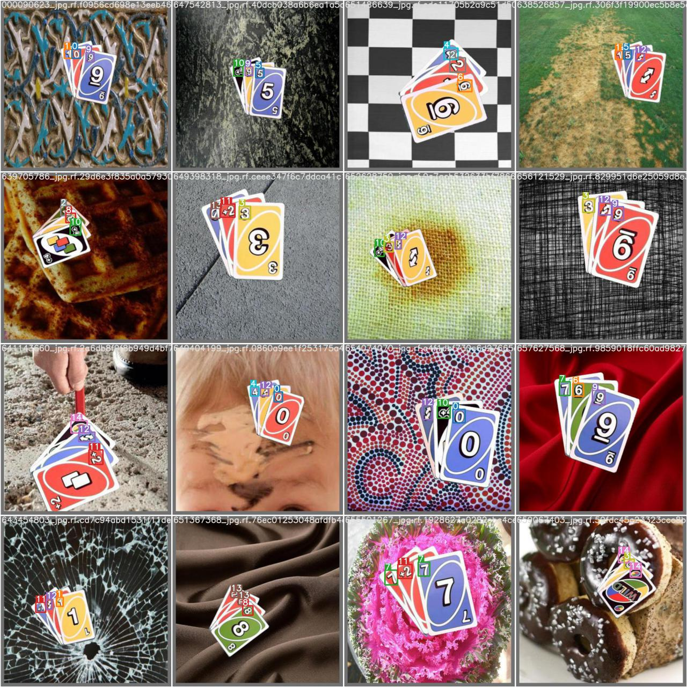

## Requirements
* Python>=3.7.0  
* PyTorch>=1.7  
* `pip install -r requirements.txt`

## Dataset
  The dataset is available on download [here](https://public.roboflow.com/object-detection/uno-cards/2)
## Training

`python train.py --img 640 --cfg yolov5s.yaml --hyp hyp.scratch.yaml --batch 32 --epochs 100 --data road_sign_data.yaml --weights yolov5s.pt  --name yolo_road_det`

### Parameters:
* img : Size of image  
* batch : The batch size  
* epochs : Number of epochs to train for  
* data : Data YAML file that contains information about the dataset (path of images, labels)  
* workers : Number of CPU workers  
* cfg : Model architecture. There are 4 choices available: yolo5s.yaml, yolov5m.yaml, yolov5l.yaml, yolov5x.yaml  
* weights: Pretrained weights you want to start training from. If you want to train from scratch, use `--weights ' '`  
* name: Various things about training such as train logs. Training weights would be stored in a folder named `runs/train/name`  
* hyp: YAML file that describes hyperparameter choices. For examples of how to define hyperparameters, see `data/data_uno_cards.yaml`

## Testing

`python val.py --data data.yaml --weights model.pt`

### Parameters:
* data : Data YAML file that contains information about the dataset (path of images, labels)  
* weights: Pretrained weights to make predictions

## Inference

`python detect.py --weights yolov5s.pt --img 640 --conf 0.25 --source data/images`

Note: results will be saved to `runs/detect`
### Parameters:
* weights: Pretrained weights to make predictions
* img : Size of image  
* conf: Thresholding objectness confidence  
* source: The source of detector, which can be: single image, folder of images, Video, Webcam

## Web application
`python run_web_app.py --path path_to_model.pt`

* path: path to trained weights
## Google Colab stuff

* Training_yolov5_Colab.ipynb : train, inference using GPU  
* Flask_Web_App.ipynb : flask application  
* Real_time_object_detection_w_webcam.ipynb : real time object detection

## Results
 
 
 
